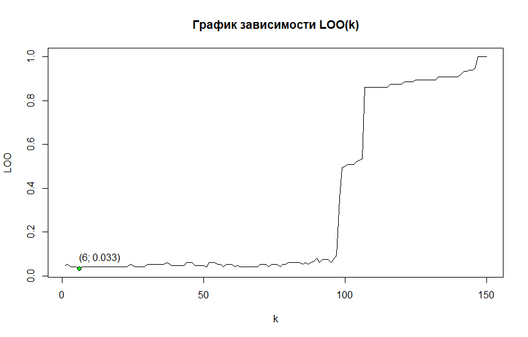

# Алгоритм ближайших соседей (kNN)
## Алгоритм kNN
**Алгоритм kNN** - метрический алгоритм классификации, основанный на оценивании сходства объектов. Классифицируемый объект относится к тому классу, которому принадлежат ближайшие к нему объекты обучающей выборки.

### Формула алгоритма kNN выглядит следующим образом:
\
где **y<sup>i</sup>** отсортированы по расстоянию относительно классифицируемого объекта,\
а **k** -- параметр, который определяет, сколько объектов будет использованно для классификации

### Реализация алгоритма на языке R
```r
knn <- function(dat, p, k = c(6)) {
  # calculate distances to each node in data
  dists <- vector("list", length(dat[[1]]))
  for (i in 1:length(dat[[1]])) {
    dists[[i]] <- dist(dat[i,][1:2], p)
  }
  
  # add distance to initial data
  dat <- data.frame(dat, "Distance" = unlist(dists))
  # sort data by distance
  dat <- dat[order(dat$Distance),]

  res <- list()  
  for (i in seq(length(k))) {
    # take first k values from data
    datK <- head(dat, k[i])
    # count occurances of each group
    occs <- summary(datK$Species)
    # most occuring group  
    res[i] <- names(sort(occs, decreasing = TRUE))[1]
  }
  
  return (unlist(res))
}
```
### Выберем оптимальноё *k*, воспользовавшись критерием скользящего контроля LOO

#### Таким образом оптимальное k=6
## Карта классификации kNN


## Алгоритм kwNN
При взвешенном способе во внимание принимается не только количество попавших в область определённых классов, но и их удалённость от нового значения. Для каждого класса определяется оценка близости. У какого класса выше значение близости, тот класс и присваивается новому объекту.

### Формула алгоритма kNN выглядит следующим образом
\
где **w(i)** -- функция веса, которая показывает насколько сильно *i*-ый объект влияет на пренадлежность классифицируемого объекта к классу *u*; функция представляет собой геометрическую прогрессию с параметром *q* из диапозона *[0; 1]* (например: **w(i) = q^i**).

### Реализация алгоритма на языке R
```r
kwnn <- function(dat, p, k=c(6), q = c(0.8)) {
  # calculate distances to each node in data
  dists <- vector("list", length(dat[[1]]))
  for (i in 1:length(dat[[1]])) {
    dists[[i]] <- dist(dat[i,][1:2], p)
  }
  
  # add distance to initial data
  dat <- data.frame(dat, "Distance" = unlist(dists))
  # sort data by distance
  dat <- dat[order(dat$Distance),]
  
  lk <- length(k)
  lq <- length(q)
  # result matrix with k values as rows
  # and q values as columns
  # matrix values are classification result 
  res <- array(0, c(lq, lk))
  for (iq in seq(lq)) {
    w <- q[iq]
    
    for (ik in seq(lk)) {
      kv <- k[ik]
      # how much p is close to each class
      freq <- as.list(rep(0, length(levels(dat$Species))))
      names(freq) = levels(dat$Species)
      
      for (j in seq(kv)) {
        e <- dat[j,]
        freq[[e$Species]] <- freq[[e$Species]] + w ^ j
      }

      res[iq, ik] <- names(sort(unlist(freq), decreasing = TRUE))[1]
    }
  }
  
  return (res)
}
```
### Выберем оптимальные *q* и *k*, воспользовавшись критерием скользящего контроля LOO
Так как *k* является целым числом, а *q* находится в диапозоне [0; 1], то будем использовать *q+k* по одной из осей.

#### Таким образом оптимальное *k*=6, а *q*=1
## Карта классификации kwNN

## Преимущество kwnn над knn
Предположим, что есть два класса объектов с разной плотностью распределения этих объектов. В таком случае алгоритм knn будет классифицировать "спорные" (находящиеся на границе двух классов) объекты к тому классу, чьи объекты расположены плотнее. Для более равномерной классификации объектов между двумя классами можно воспользоваться алгоритмом kwnn.\
Ниже представлен пример такой ситуации:\
● -- объекты обучающей выборки;\
○ -- объекты, классифицируемые алгоритмами knn и kwnn одинаково;\
▼ -- объекты, классификация которых по kwnn отличается от knn;

Начальные объекты | [После классификации
:----------------:|:-------------------:
|