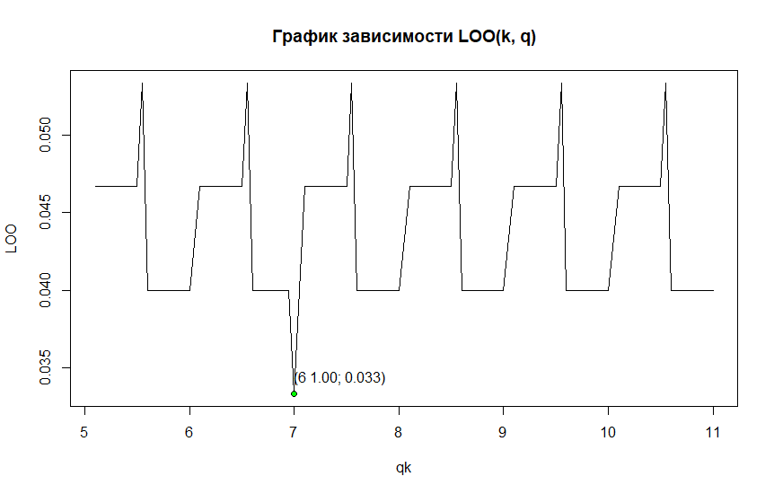

# Алгоритм ближайших соседей (kNN)
## Алгоритм kNN
**Алгоритм kNN** - метрический алгоритм классификации, основанный на оценивании сходства объектов. Классифицируемый объект относится к тому классу, которому принадлежат ближайшие к нему объекты обучающей выборки.

### Формула алгоритма kNN выглядит следующим образом
\
где *k* - параметр

### Реализация алгоритма на языке R
```r
knn <- function(dat, p, k = c(6)) {
  # calculate distances to each node in data
  dists <- vector("list", length(dat[[1]]))
  for (i in 1:length(dat[[1]])) {
    dists[[i]] <- dist(dat[i,][1:2], p)
  }
  
  # add distance to initial data
  dat <- data.frame(dat, "Distance" = unlist(dists))
  # sort data by distance
  dat <- dat[order(dat$Distance),]

  res <- list()  
  for (i in seq(length(k))) {
    # take first k values from data
    datK <- head(dat, k[i])
    # count occurances of each group
    occs <- summary(datK$Species)
    # most occuring group  
    res[i] <- names(sort(occs, decreasing = TRUE))[1]
  }
  
  return (unlist(res))
}
```
### Выберем оптимальноё *k*, воспользовавшись критерием скользящего контроля LOO

#### Таким образом оптимальное k=6
## Карта классификации kNN


## Алгоритм kwNN
При взвешенном способе во внимание принимается не только количество попавших в область определённых классов, но и их удалённость от нового значения. Для каждого класса определяется оценка близости. У какого класса выше значение близости, тот класс и присваивается новому объекту.

### Формула алгоритма kNN выглядит следующим образом
\
где **w(i) = q^i** - геометрическая прогрессия с параметром q

### Реализация алгоритма на языке R
```r
kwnn <- function(dat, p, k=6, q = c(0.8)) {
  # calculate distances to each node in data
  dists <- vector("list", length(dat[[1]]))
  for (i in 1:length(dat[[1]])) {
    dists[[i]] <- dist(dat[i,][1:2], p)
  }
  
  # add distance to initial data
  dat <- data.frame(dat, "Distance" = unlist(dists))
  # sort data by distance
  dat <- dat[order(dat$Distance),]
  
  res <- list()
  # take first k values from data
  datK <- head(dat, k)
  
  freq <- as.list(rep(0, length(levels(dat$Species))))
  names(freq) = levels(dat$Species)
  
  for (j in seq(length(q))) {
    for (l in seq(k)) {
      e <- datK[l,]
      freq[[e$Species]] <- freq[[e$Species]] + q[j] ^ l
    }
    # most occuring group  
    res[j] <- names(sort(unlist(freq), decreasing = TRUE))[1]
  }
  
  return (unlist(res))
}
```
### Выберем оптимальноё *q*, воспользовавшись критерием скользящего контроля LOO

#### Таким образом оптимальное k=0.8
## Карта классификации kNN
