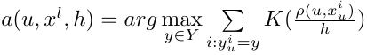
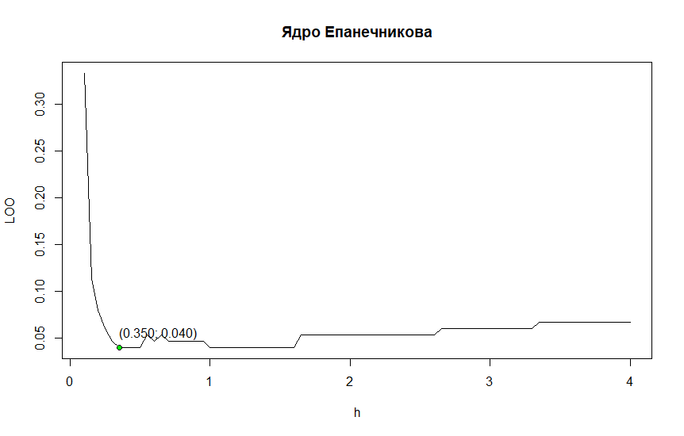
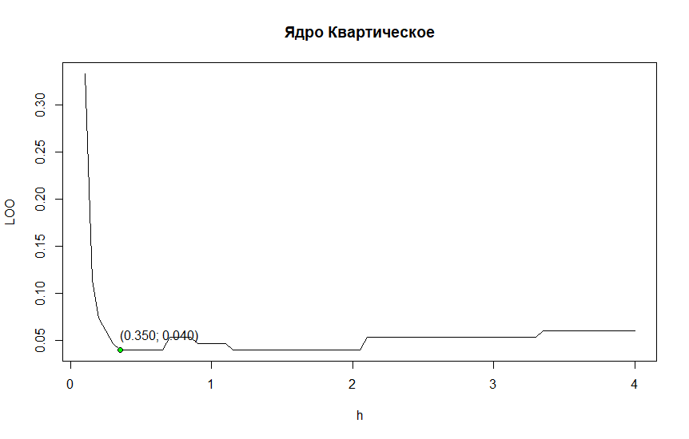
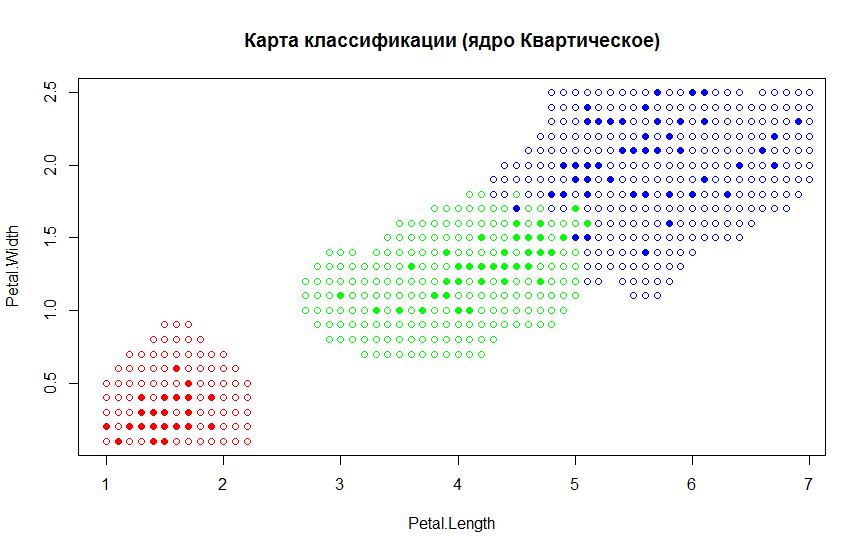
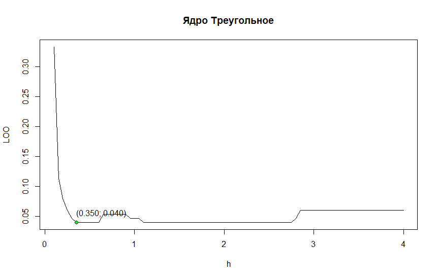
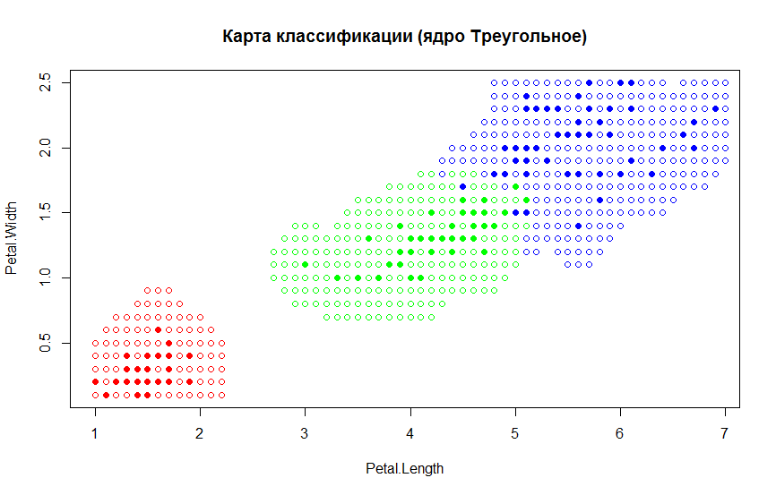
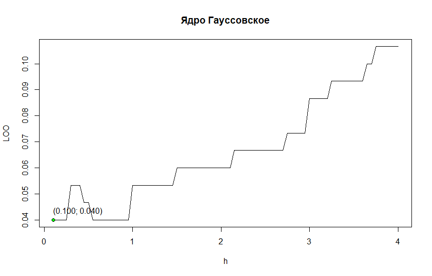
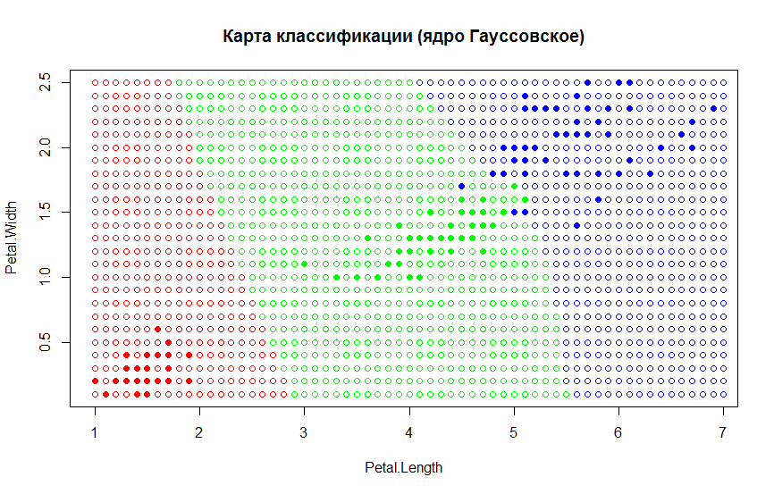
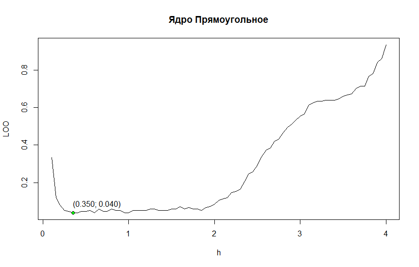
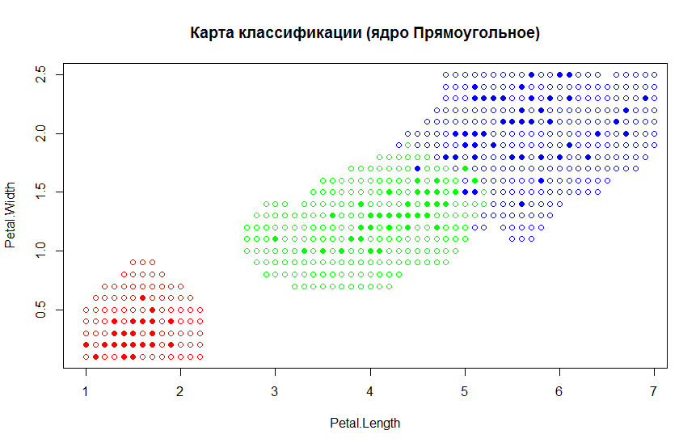

# Метод Парзеновского окна
**Метод Парзеновского окна** -- метрический алгоритм классификации, основанный на оценивании сходства объектов. Классифицируемый объект относится к тому классу, которому принадлежат ближайшие к нему объекты обучающей выборки. При чем, объекты учитываются не по рангу, как в kNN и kwNN, а по расстоянию. 

### Формула Парзеновского окна выглядит следующим образом:
\
где **K(x)** -- невозрастающая на **[0; ∞)** функция ядра,\
а **h** -- параметр (ширина окна).\
Если плотность объектов в пространстве неоднородна, то имеет смысл использовать переменную ширину окна, тогда формула приобретает следующий вид:\


### Реализация на языке R
```r
# ParWin algo
parwin <- function(dat, p, core, h = c(0.35)) {
  ld <- length(dat[[1]])
  lh <- length(h)
  # calculate distances to each node in data
  dists <- vector("list", )
  for (i in seq(ld)) {
    dists[[i]] <- dist(dat[i,][1:2], p)
  }
  
  # add distance to initial data
  dat <- data.frame(dat, "Distance" = unlist(dists))
  # sort data by distance
  dat <- dat[order(dat$Distance),]
  
  res <- array(0, lh)
  for (i in seq(lh)) {
    vh <- h[i]
    # how much p is close to each class
    freq <- as.list(rep(0, length(levels(dat$Species))))
    names(freq) = levels(dat$Species)
    
    for (j in seq(ld)) {
      vd <- dat[j,]
      
      freq[[vd$Species]] <- freq[[vd$Species]] + core(vd$Distance / vh)
    }
    
    freq <- unlist(freq)
    # if we didn't get into any windows then no class
    if (max(freq) == 0) {
      res[i] <- ""
    }
    else
    {
      res[i] <- names(sort(freq, decreasing = TRUE))[1]
    }
  }
  
  return (res)
}
```
### Выберем оптимальное *h*, воспользовавшись критерием скользящего контроля LOO для некоторых функций ядер и построим карту классификации

Ядро | Оптимальное *h* и значение LOO | График LOO(h)
:---:|:---------:|:------------------:
Епанечникова | h=0.35 LOO=0.04 |  
Квартическое | h=0.35 LOO=0.04 |  
Треугольное | h=0.35 LOO=0.04 |  
Гауссовское | h=0.1 LOO=0.04 |  
Прямоугольное | h=0.35 LOO=0.04 |  
#### Таким образом оптимальное *h* для всех ядер кроме Гауссовского -- 0.35, а для Гауссовского -- 0.1