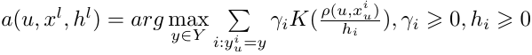
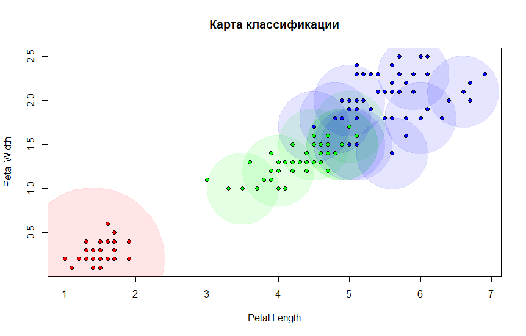
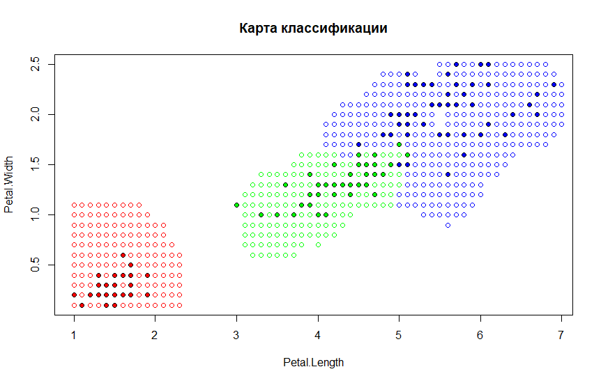
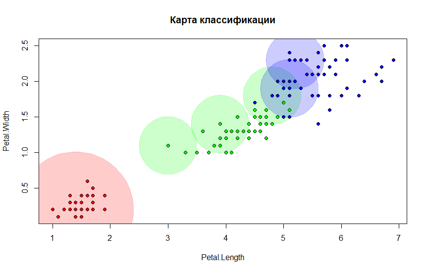
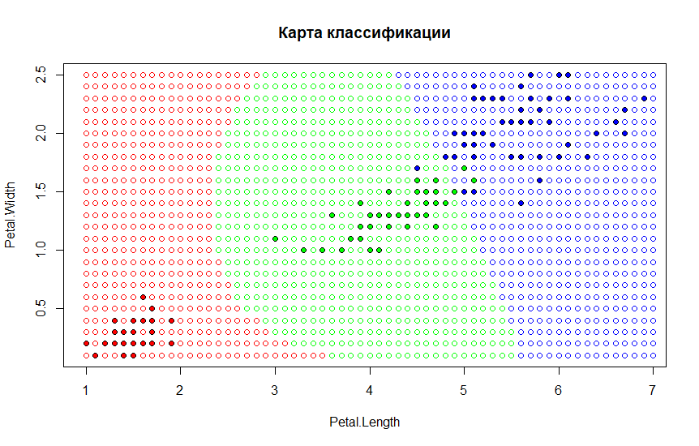

# Метод потенциальных функций
Если в методе [Парзеновского](/lab2) окна центр окна поместить в классифицируемый объект, то получим метод:
\
где **h<sub>i</sub>** -- размер окна для каждого элемента обучающей выборки

### Реализация на языке R
```r
# potfunc algo
potfunc <- function(dat, p, core, g, h) {
  ld <- dim(dat)[1]
  classCount <- dim(table(dat$Species))
  
  classes <- rep(0, classCount)
  names(classes) <- levels(dat$Species)
  
  for (i in seq(ld)) {
    e <- dat[i,]
    distance <- dist(p, e[1:2])
    
    weight <- core(distance / h[i]) * g[i]
    classes[e$Species] <- classes[e$Species] + weight
  }
  
  if (max(classes) == 0) {
    return ("")
  }
  return (names(which.max(classes)))
}

# count errors
errVal <- function(dat, core, g, h) {
  ld <- dim(dat)[1]
  err <- 0
  
  for (i in seq(ld)) {
    e <- dat[i,]
    res <- potfunc(dat, e[1:2], core, g, h)
    
    err <- err + (res != e$Species)
  }
  
  cat("err: ", err, "\n")
  #cat("g: ", g, "\n")
  return(err)
}

# calculate g
calcG <- function(dat, core, h, maxErr = 10) {
  ld <- dim(dat)[1]
  
  g <- rep(0, ld)
  i <- 1
  while(errVal(dat, core, g, h) > maxErr) {
    e <- dat[i,]
    res <- potfunc(dat, e[1:2], core, g, h)
    
    if (res != e$Species)
    {
      g[i] <- g[i] + 1
    }
    
    i <- sample(seq(ld), 1)
    #cat("i: ", i, "\n")
  }
  
  return(g)
}
```

В реализуемом методе используется фиксированная ширина окна. Для первых 50 объектов (class=setosa) h=1, так как объекты данного класса достаточно удалены от объектов других. Для остальных объектов h=0.5.

## Карты классификации и визуализация потенциалов
Для визуализации потенциалов в каждом из элементов выборки с ненулевым потенциалом, построим окружность с центром в этом элементе и радиусом, равным значению *h* для этого элемента.

Для Треугольного ядра с максимумом ошибок = 5 визуализация и карта классификации будут выглядеть следующим образом
Визуализация | Карта классификации
:-----------:|:------------------:
|

И для Гауссовского ядра с максимумом ошибок = 5
Визуализация | Карта классификации
:-----------:|:------------------:
|
