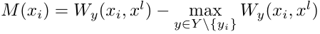
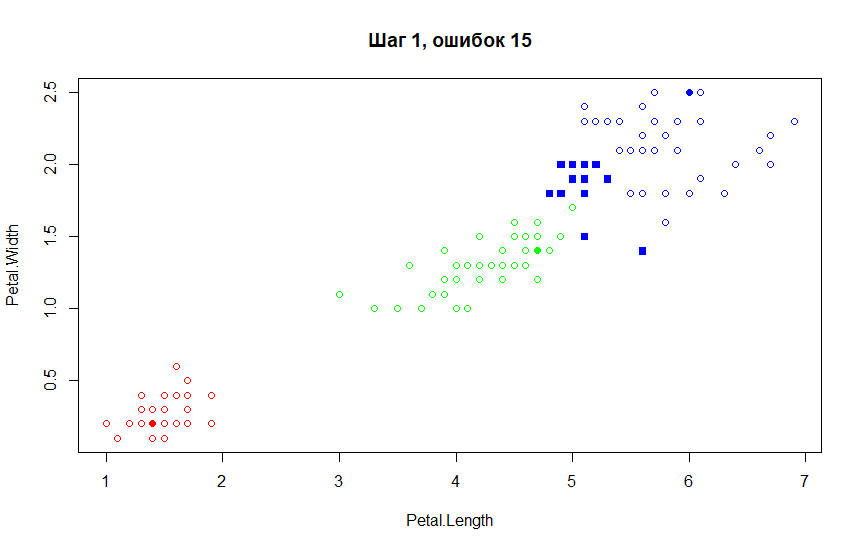
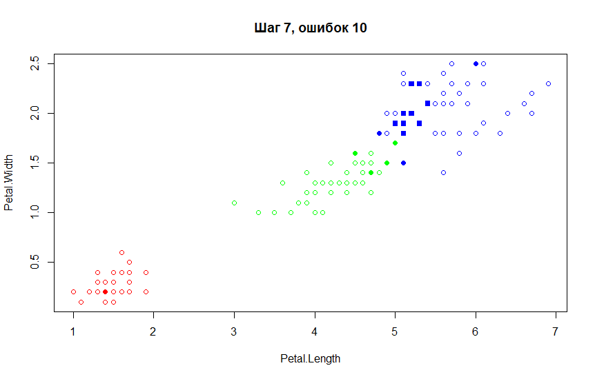
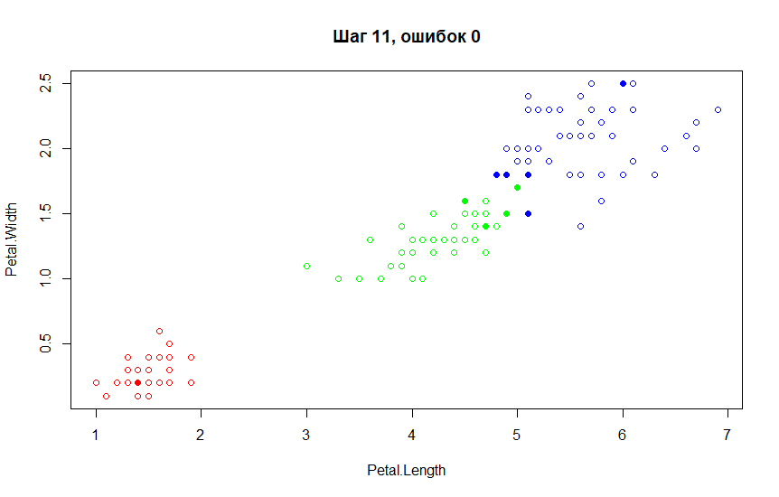
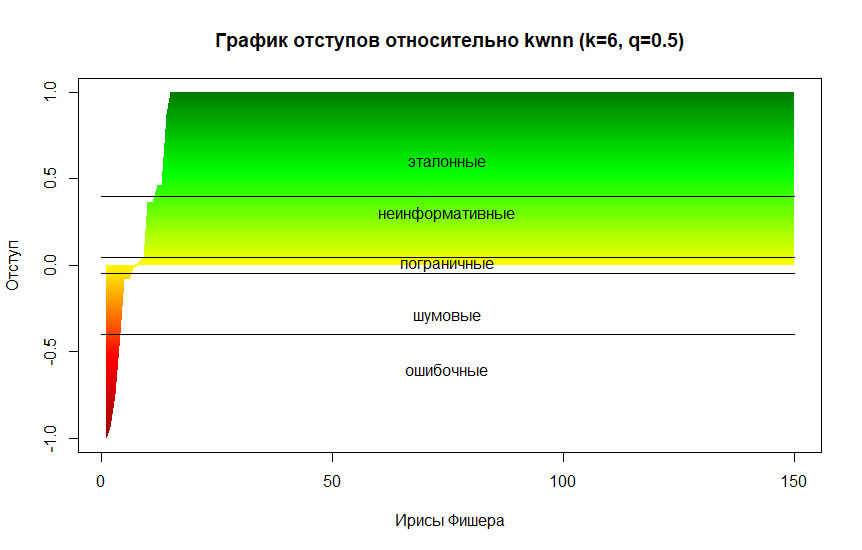
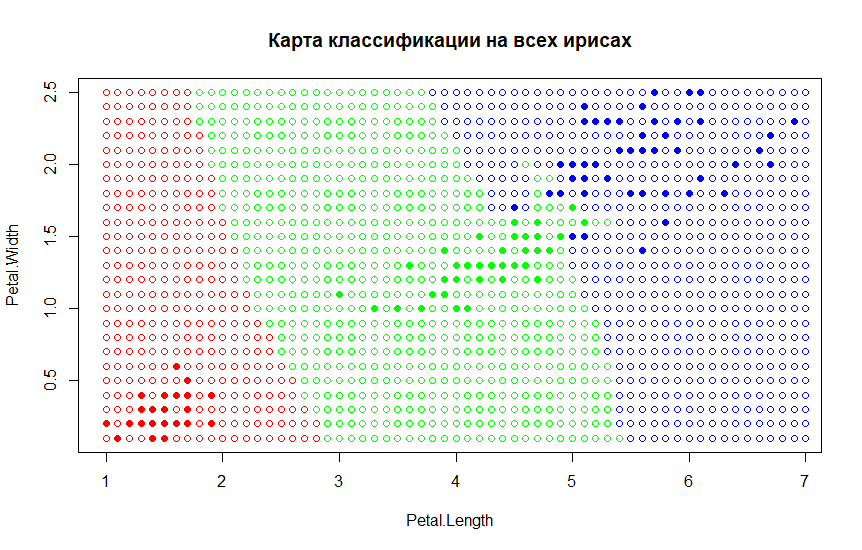
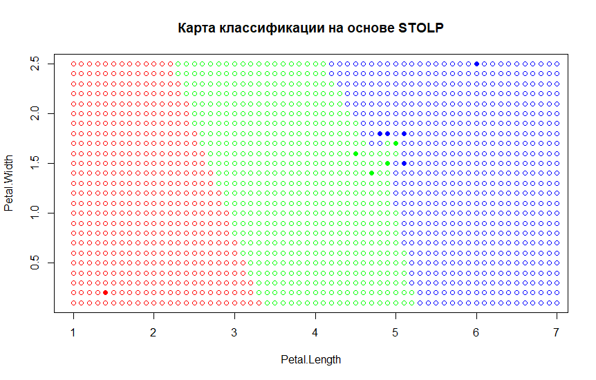

# Отбор эталонных объектов
## Алгоритм СТОЛП (STOLP) — алгоритм отбора эталонных объектов для метрического классификатора.

Алгорим STOLP исключает из выборки объекты, слабо влияющие на качество классификации, оставляя лишь нужное количество эталонных. Таким образом улучшается качество классификации, сокращается объем данных и уменьшается время классификации объектов.

Алгоритм использует функцию отступа:
\
где **W** -- функция веса, зависящая от выбранного алгоритма классификации.\
Если нормировать значения отступов, то можно выделить следующие следующие виды объектов обучаемого множества:
* пограничные (M около 0)
* шумовые (M меньше 0)
* неинформативные (M больше 0) -- плотно окружены другими объектами того же класса. Если их удалить из выборки, это практически не отразится на качестве классификации
* ошибочные (M сильно меньше 0) -- находятся в окружении объектов чужого класса. Как правило, их удаление только улучшает качество классификации
* эталонные (M сильно больше 0) -- типичные представители классов. Если классифицируемый объект близок к эталону, то, скорее всего, он принадлежит тому же классу

Сам алгоритм STOLP формулируется следующим образом:
1. Входные данные:
    - обучающая выборка **X**
    - допустимая доля ошибок **l**
    - порог отсечения выбросов **δ**
    - алгоритм классификации
1. Отбросить выбросы
1. Сформировать начальное приближение **Ω**, взяв по эталонному объекты из каждого класса
1. Пока **Ω** != **X**
    + Классифицировать объекты **X**, используя в качестве обучающей выборки **Ω**
    + Если число ошибок классификации обучающей выборки меньше **l**, завершить цикл
    + Добавить к **Ω** объект из **X** с наименьшим отступом
    
## Реализация алгоритма на языке R
```r
stolp <- function(dat, l=0, sigma=-0.1, funcW = kwnnW) {
  margs <- margins(dat, funcW)
  
  # отброситьь выбросы
  bad <- which(margs < sigma)
  dat <- dat[-bad,]
  margs <- margs[-bad]

  # взять по эталону из каждого класса
  classes <- levels(dat$Species)
  omega <- data.frame(dat[-seq(dim(dat)[1]),])
  for (i in seq(length(classes))) {
    omega[dim(omega)[1]+1,] <- (dat[which(dat$Species == classes[i]),])[which.max(margs),]
  }
  
  # индексы объектов, которые будем добавлять 
  queue <- seq(dim(dat)[1])[order(margs)]
  step <- 1
  while (dim(omega)[1] != dim(dat)[1]) {
    # классифицируем объекты обучающей выборки
    n <- dim(dat)[1]
    err <- rep(FALSE, n)
    for (i in seq(n)) {
      e <- dat[i,]
      err[i] <- names(which.max(funcW(omega, e[1:2]))) != e$Species
    }
        
    if (sum(err) <= l) {
      break
    }
    
    # добавляем объект с наименьшим отступом
    omega[dim(omega)[1]+1,] <- dat[queue[1],]
    queue <- queue[-1]
    step <- step + 1
  }
  
  return (omega)
}
```

## Пример работы STOLP на некоторых шагах
● -- эталонные объекты из **Ω**\
○ -- верно классифицируемые объекты из обучающей выборки\
■ -- ошибочно классифицируемые объекты из обучающей выборки\




## Рассмотрим значения отступов для ирисов Фишера
Алгоритм kwNN | Алгоритм kNN
:-:|:-:
 | 

## Оптимизация и результаты
Благодаря сокращению обучающей выборки STOLP позволяет значительно сократить время, затрачиваемое на классификацию объектов, при этом не сильно влияя на качество самой классификации. В таблице ниже представлено время, затраченное на классификацию одних и тех же объектов (создания карты классификации) с использованием STOLP и без.

&nbsp; | Время | Ошибка
:----: | :---: | :----: 
Без STOLP | 6.430004 mins | 0.04666667
C STOLP | 13.21521 secs | 0.02

Без STOLP | С STOLP
:-------: | :-----:
 | 