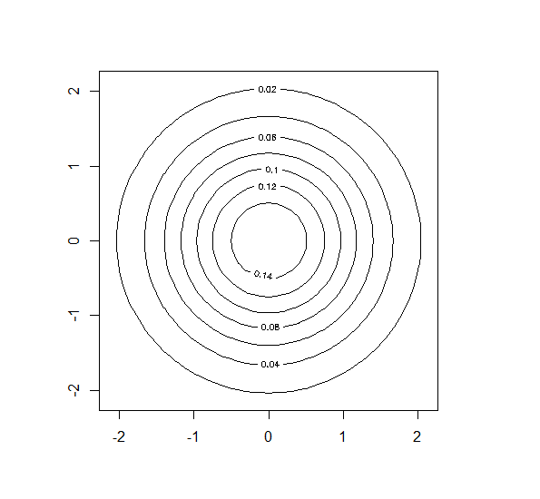

# Линии уровня нормального распределения
### Вероятностное распределение с плотностью
\
называется n-мерным многомерным нормальном распределением\
с математическим ожиданием (центром) ,\
и ковариационной матрицей .\
Предполагается, что матрица симметричная, невырожденная, положительно определенная.

## Геометрия нормальной плотности
1. Если признаки некоррелированны, то матрица ковариации имеет диагональный вид, а линия плотности имеет форму эллипсоида
1. Если признаки имеют одинаковую дисперсию, то эллипсоиды являются сферами
1. Если признаки коррелированы, то матрица не диагональна, а линии уровня имеют форму эллипсоида, оси которого повернуты относительно системы координат

 Некоррелированы | Одинаковая дисперсия | Коррелированы
:-: | :-: | :-:
 |  | 

## Реализация на R
```r
drawLines <- function(center, cv) {
  det <- det(cv)
  a <- cv[2, 2] / det
  b <- -cv[1, 2] / det
  c <- -cv[2, 1] / det
  d <- cv[1, 1] / det
  
  x0 <- center[1]
  y0 <- center[2]
  
  A <- d
  B <- a
  C <- -c -b
  D <- -2*d*x0 + y0*(c+b)
  E <- -2*a*y0 + x0*(c+b)
  F <- d*x0^2 + a*y0^2 + x0*y0*(-c-b)
  
  func <- function(x, y) {
    1 / (2*pi*sqrt(det)) * exp(-0.5 * (x^2*A + y^2*B + x*y*C + x*D + y*E + F))
  }
  
  X <- seq(-2-0.1, 2+0.1, 0.1)
  Y <- seq(-2-0.1, 2+0.1, 0.1)
  Z <- outer(X, Y, func)
  
  contour(X, Y, Z)
}
```
С реализацией на **shiny** можно ознакомиться по
    [ссылке](https://skycolor.shinyapps.io/ML0BayesLevelLines/)