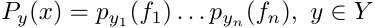
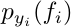
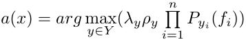
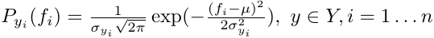
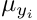
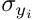
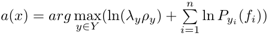
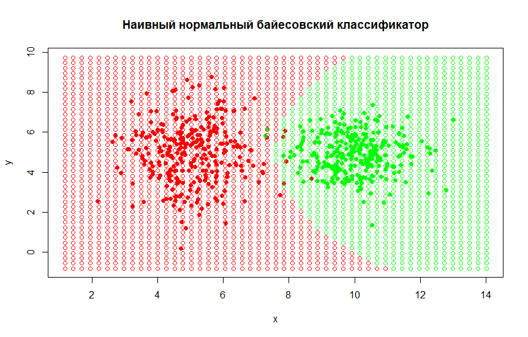

# Наивный нормальный байесовский классификатор

Пусть имеется некий набор объектов, каждый объект имеет **n**
числовых признаков **f<sub>i</sub>**. Предположим, что все признаки независимы
друг от друга. Тогда функция правдоподобия классов представима в виде:
, где  -- плотность распределения
значений **i**-того признака. Подставив получившуюся функцию правдоподобия
классов в оптимальный байесовский классификатор получим:\
\
Это и есть наивный нормальный байесовский классификатор, наивный он именно
потому что, предположение о независимости признаков является наивным.

Для вычисления плотности распределения воспользуемся формулой гауссовской плотности:\
\
где  -- мат. ожидание **i**-того признака, а  -- дисперсия **i**-того признака для класса **y**.

Для программной реализации имеет смысл прологарифмировать
максимизируемое выражение, в таком случае классификатор приобретает вид:\


## Пример работы классификатора


## Программная реализация
```r
# Вычисляем мат. ожидание
getM <- function(xs) {
  l <- dim(xs)[2]
  res <- matrix(NA, 1, l)
  for (i in seq(l)) {
    res[1, i] <- mean(xs[,i])
  }
  return(c(res))
}

# Вычисляем дисперсию
getD <- function(xs, mu) {
  rows <- dim(xs)[1]
  cols <- dim(xs)[2]
  
  res <- matrix(0, 1, cols)
  for (i in seq(rows)) {
    res <- res + (xs[i,] - mu)^2
  }
  
  return(c(res/(rows-1)))
}

# Вычисляем плотность
getPyj <- function(x, M, D){
  return( (1/(D*sqrt(2*pi))) * exp(-1 * ((x - M)^2)/(2*D^2)) )
}

# Наивный классификатор
naiveBayes <- function(x, M, D, Prob, Prior) {
  res <- log(Prob * Prior)
  l <- length(x)
  
  for (i in seq(l)) {
    p <- getPyj(x[i], M[i], D[i])
    res <- res + log(p)
  }
  
  return(res)
}
```

С реализацией на **shiny** можно ознакомиться по
    [ссылке](https://skycolor.shinyapps.io/ML0NaiveBayes/)