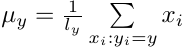

# Подстановочный алгоритм (plug-in)

Алгоритм заключается в восстановлении параметров нормального распределения **μ<sub>y</sub>**, **Σ<sub>y</sub>** для каждого класса **y** из **Y** и подстановке их в формулу оптимального байесовского классификатора. Предполагается, что ковариационные матрицы классов не равны.

Оценка параметров нормального распределения производится на основе принципа максимума правдоподобия:\
\


Разделяющая поверхность между двумя классами **a** и **b** задаётся следующим образом:\

где


Прологарифмируем обе части выражения и путем простых приведений
получим уравнение разделяющей поверхности, которая является кривой
второго порядка.

## Результат работы алгоритма
В зависимости от параметров классов разделяющая поверхность может принимать различные формы.
Ниже представлены примеры различных форм поверхности для двумерного случая:

 &nbsp; | &nbsp;
:-: | :-:
1. Прямая | 
2. Эллипс | 
3. Гипербола | 

## Реализация на R
```r
# Восстанавливаем центр (отклонение)
estimateMu <- function(xs) {
  l <- dim(xs)[2]
  res <- matrix(NA, 1, l)
  for (i in seq(l)) {
    res[1, i] <- mean(xs[,i])
  }
  return(res)
}

# Восстанавливаем ковариационную матрицу
estimateSigma <- function(xs, mu) {
  rows <- dim(xs)[1]
  cols <- dim(xs)[2]
  
  res <- matrix(0, cols, cols)
  for (i in seq(rows)) {
    res <- res + t(xs[i,] - mu) %*% (xs[i,] - mu)
  }
  
  return(res/(rows - 1))
}

# Вычисляем функцию разделяющей поверхности
getFunc <- function(sigma1, mu1, sigma2, mu2) {
  d1 <- det(sigma1)
  d2 <- det(sigma2)
  invs1 <- solve(sigma1)
  invs2 <- solve(sigma2)
  
  a <- invs1 - invs2
  b <- invs1 %*% t(mu1) - invs2 %*% t(mu2)
  
  A <- a[1,1] # x^2
  B <- a[2,2] # y^2
  C <- 2 * a[1, 2] # xy
  D <- -2 * b[1, 1] # x
  E <- -2 * b[2, 1] # y
  G <- c(mu1 %*% invs1 %*% t(mu1) - mu2 %*% invs2 %*% t(mu2)) + log(abs(det(sigma1))) - log(abs(det(sigma2)))
  
  func <- function(x, y) {
    x^2 * A + y^2 * B + x*y*C + x*D + y*E + G
  }
  
  return(func)
}
```

С реализацией на **shiny** можно ознакомиться по
    [ссылке](https://skycolor.shinyapps.io/ML0PlugInAlgo/)