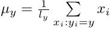
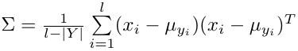
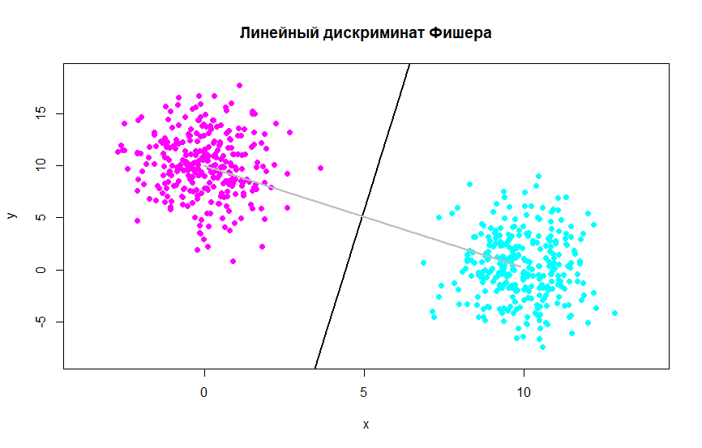

# Подстановочный алгоритм (plug-in)

Алгоритм похож на [подстановочный](/lab7), но в отличии он него имеет следующее условие: ковариационные матрицы **Σ<sub>y</sub>** равны. При этом формула оценки центра нормального распределения **μ<sub>y</sub>** остаётся неизменной, а вместо оценки каждой ковариационной матрицы, оценивается одна общая ковариационная матрица.

Оценка параметров нормального распределения производится на основе принципа максимума правдоподобия:\
\


Разделяющая поверхность между двумя классами **a** и **b** задаётся точно также
как и в [подстановочном](/lab7) алгоритме, единственное отличие в том, что
для подсчета коэффициентов разделяющей поверхности теперь используются
две одинаковые ковариационные матрицы.

## Пример работы алгоритма


## Реализация на R
```r
# Восстанавливаем центр (отклонение)
estimateMu <- function(xs) {
  l <- dim(xs)[2]
  res <- matrix(NA, 1, l)
  for (i in seq(l)) {
    res[1, i] <- mean(xs[,i])
  }
  return(res)
}

# Восстанавливаем ковариационную матрицу
estimateSigma <- function(xs1, mu1, xs2, mu2) {
  rows1 <- dim(xs1)[1]
  cols <- dim(xs1)[2]
  rows2 <- dim(xs2)[1]
  
  res <- matrix(0, cols, cols)
  for (i in seq(rows1)) {
    res <- res + t(xs1[i,] - mu1) %*% (xs1[i,] - mu1)
  }
  for (i in seq(rows2)) {
    res <- res + t(xs2[i,] - mu2) %*% (xs2[i,] - mu2)
  }
  
  return(res/(rows1 + rows2 + 2))
}

# Вычисляем функцию разделяющей поверхности
getFunc <- function(sigma, mu1, mu2) {
  d <- det(sigma)
  invs <- solve(sigma)
  
  b <- invs %*% t(mu1) - invs %*% t(mu2)
  
  D <- -2 * b[1, 1] # x
  E <- -2 * b[2, 1] # y
  G <- c(mu1 %*% invs %*% t(mu1) - mu2 %*% invs %*% t(mu2))
  
  func <- function(x, y) {
    x*D + y*E + G
  }
  
  return(func)
}
```

С реализацией на **shiny** можно ознакомиться по
    [ссылке](https://skycolor.shinyapps.io/ML0LDF/)