# Линейные алгоритмы
Линейный классификатор -- это алгоритм классификации вида:
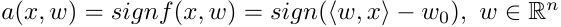,\
где **w<sub>j</sub>** -- вес j-го признака,
**w<sub>0</sub>** -- порог принятия решения,
**w = (w<sub>0</sub>, w<sub>1</sub>, ..., w<sub>n</sub>)** -- вектор весов.	

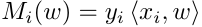 -- отступ объекта, относительно алгоритма классификации. 
Если отступ отрицателен, значит алгоритм совершает ошибку на объекте **x<sub>i</sub>**.\
**L(M)** -- монотонно невозрастающая функция потерь,
используемая для непрерывной аппроксимации функции потерь.\

В таком случае минимизацию суммарных потерь можно представить как:
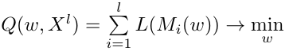

Для минимизации **Q(w)** будем использовать метод стохастического градиентного спуска.
## ADALINE

ADALINE (адаптивны линейный элемент) -- линейный алгоритм классификации.
В алгоритме используется квадратичная функция потерь: 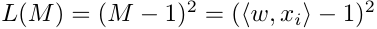,\
а также дельта правило обновления весов: 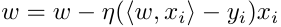

## Правило Хебба

Правило Хебба также является линейным алгоритмом.
Алгоритм использует кусочно-линейную функцию потерь: ,\
и правило Хебба для обновления весов: 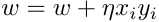

## Логистическая регрессия

Логистическая регрессия также является оптимальным байесовским классификатором. За счет этого можно также определить вероятность принадлежности элемента классу.\
Функция потерь: 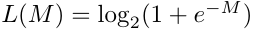\
Правило обновления: 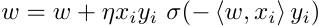, где 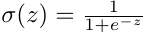\
А также вероятность принадлежности элемента **x** классу **y**: 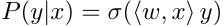

## Реализация на R
Так как для обоих алгоритмов будет использоваться метод стохастического
градиента, то вынесем отдельно функции потерь и обновления весов, а затем
подставим их в стохастический градиент.

Готовая реализация описанного алгоритма на **shiny** доступна по **[ссылке](https://skycolor.shinyapps.io/ML0ADALINE/)**.
```R
# Квадратичная функция потерь для ADALINE
adaLoss <- function(xi, yi, w) {
  mi <- c(crossprod(w, xi)) * yi
  l <- (mi - 1)^2
  return(l)
}
# дельта правило обновления для ADALINE
adaUpd <- function(xi, yi, w, eta) {
  wx <- c(crossprod(w, xi))
  #ld <- 2 * (wx - yi) * xi
  ld <- (wx - yi) * xi
  nextW <- w - eta * ld
  return(nextW)
}

# Кусочно-линейную функцию потерь для Хебба
hebbLoss <- function(xi, yi, w) {
  mi <- c(crossprod(w, xi)) * yi
  return (max(-mi, 0))
}
# правило Хебба для весов
hebbUpd <- function(xi, yi, w, eta) {
  nextW <- w + eta * yi * xi
  return (nextW)
}

## Стохастический градиент
stgrad <- function(xl, eta = 1, lambda = 1/6, eps = 1e-5, loss, upd, ...) {
  l <- dim(xl)[1]
  n <- dim(xl)[2] - 1
  w <- rep(0.5, n)
  
  Q <- 0
  Qprev <- Q
  
  # Начальное значение Q
  for (i in seq(l)) {
    xi <- xl[i, 1:n]
    yi <- xl[i, n+1]
    
    Q <- Q + loss(xi, yi, w)
  }
  
  iter <- 0
  repeat {
    # мало ли, бесконечный цикл может быть
    iter <- iter + 1
    if (iter > 1000) {
      break
    }
    
    mis <- array(dim = l)
    for (i in seq(l)) {
      xi <- xl[i, 1:n]
      yi <- xl[i, n + 1]
      
      mis[i] <- crossprod(w, xi) * yi
    }
    
    errorIndexes <- which(mis <= 0)
    if (length(errorIndexes) == 0) {
      break
    }
    
    i <- sample(errorIndexes, 1)
    xi <- xl[i, 1:n]
    yi <- xl[i, n + 1]
    
    ex <- loss(xi, yi, w)
    
    w <- upd(xi, yi, w, eta)
    
    Q <- (1 - lambda) * Q + lambda * ex
    # достигли стабилизация Q
    if (abs(Q - Qprev) < eps) {
      break
    }
    Qprev <- Q
    
    drawLine(w, ...)
  }
  
  return(w)
}

```

## Пример работы
Зелёным обозначен ADALINE, а красным -- правило Хебба.
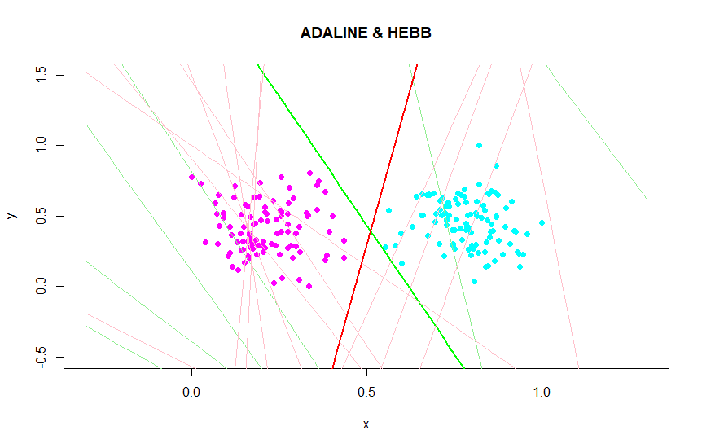

## Зависимость Q от шага итерации

ADALINE | правило Хебба
:------:|:------------:
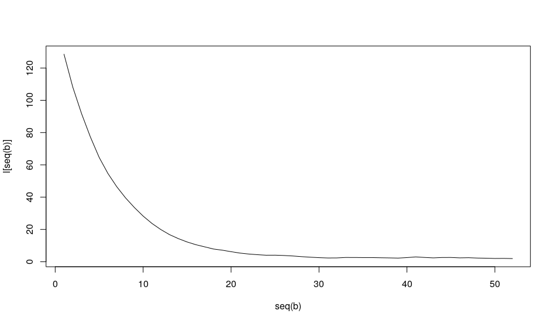 | 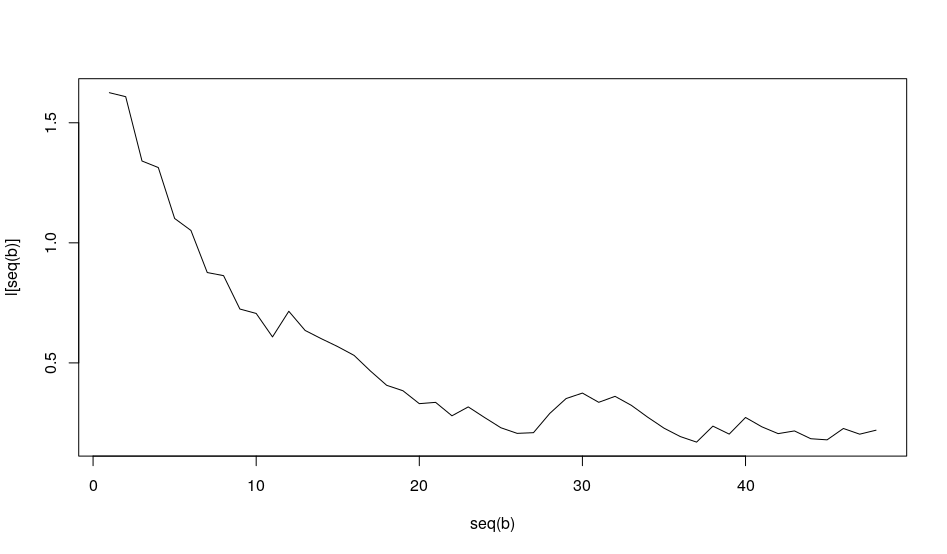
